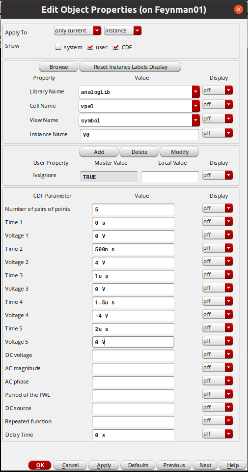
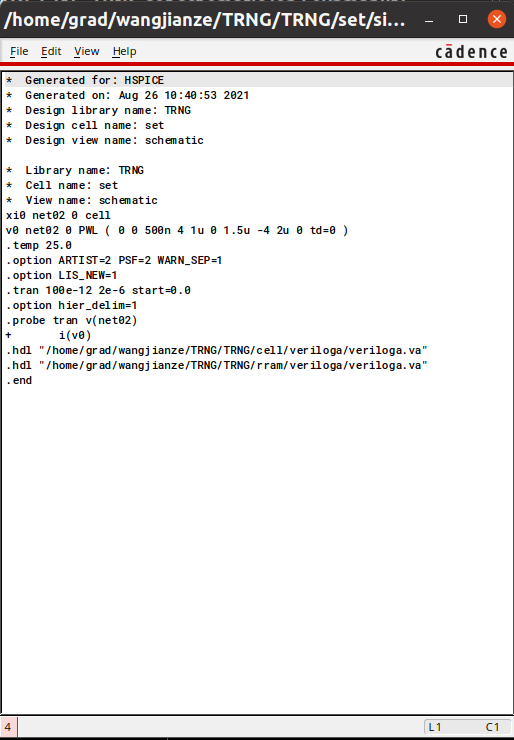
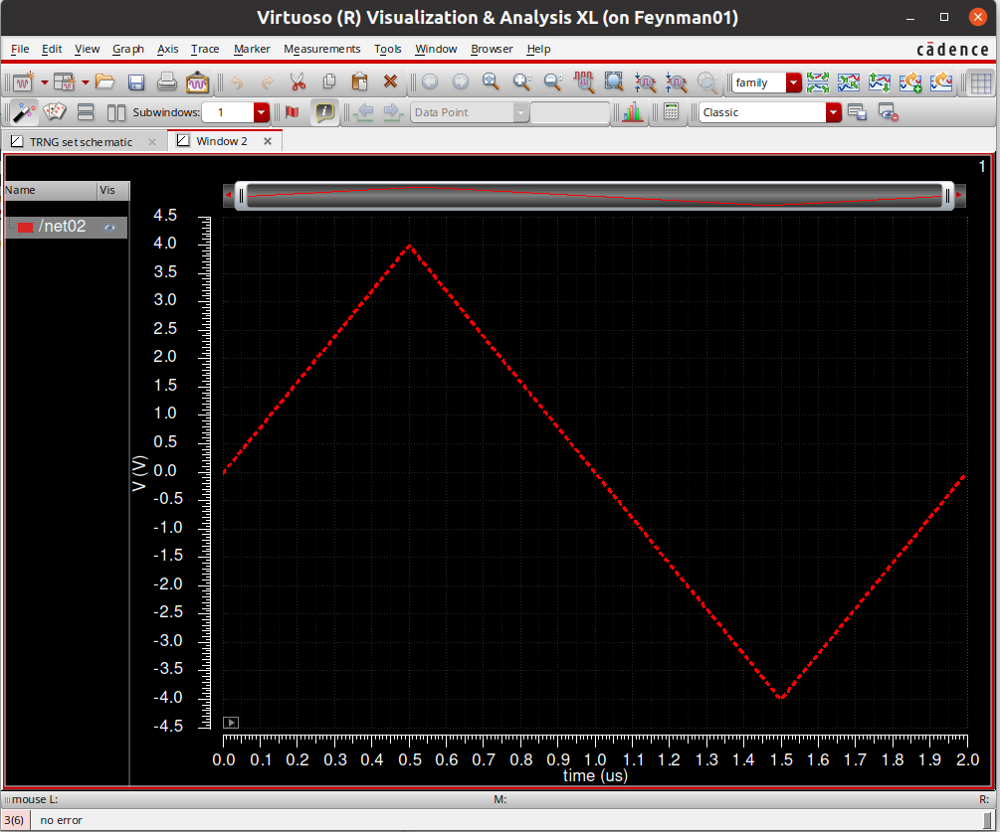

1. In instance page, choose `vpwl` in `analoglib`:

2. `Number of pairs of points` means the time-magnitude pairs.

3. Try something to see what we get if we set `vpwl` as the previous figure shows. The netlist is as follow:

4. Waveform

> Note:

As I understand, `vpwl` will create a waveform that connect the time-magnitude pairs (point in waveform) point-by-point.    
The point is defined when (time) the user-defined waveform reach the magnitude we defined (time-magnitude pairs).    
Useful tool.
